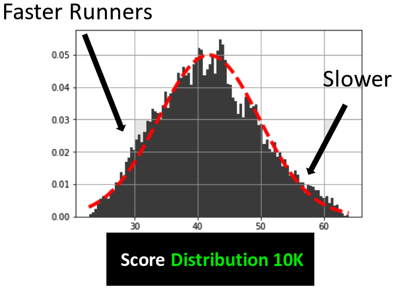
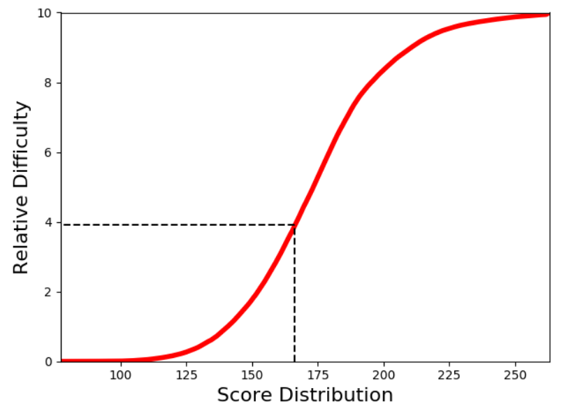
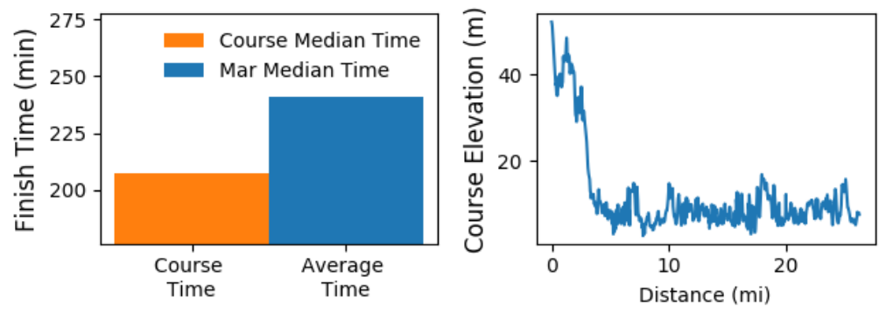

# LetsDoThis
All marathons are the same distance; however, the courses vary dramatically in difficulty. The goal of this consulting project for <a href="https://www.letsdothis.com/">LetsDoThis</a> is to estimate the difficulty of a race in order to guide users to their next challenge. This project was done in 3 weeks as a part of the <a href="https://www.insightdatascience.com">Insight Data Science Program </a> in New York City. The final product is a web application, which utilizes Python, JavaScript, Flask, AWS, and SQL, and may be seen <a href="http://racedifficultyindex.com/">here</a>; note that the link will eventually die once I stop paying for it, and the site has not been optimized for mobile access.

### Data Scraping and Cleaning
Extensive scraping has been performed from two data sources:
1. GPS coordinates (longitude, latitude, and elevation) of races, which allows one to calculate the elevation gain/loss, the standard deviation in the mean elevation (measure of hilliness), and the number of hills. This data was difficult to get but was done using Strava; you must find a Strava member's profile with pubic permissions in order to download the relevant GPX file.
2. Race results from <a href="https://www.runbritainrankings.com/">runbritain</a> which includes finish times, personal information such as sex/age, and race metadata.

Data merging and cleaning was performed using stand-alone python scripts and jupyter notebooks. I limited the analysis to **road** races, which means I excluded trail/multi terrain races. Post cleaning results in about 60 MB (350 MB) of GPS (finish time) data.

*Note that in the interest of space, the scraped and cleaned data will not been uploaded to GitHub.*

### Definition of Difficulty 
A course difficulty is not directly measurable and consequently a proxy, such as time, must be used. In this case, features that result in longer finish times on average are assumed to be associated with a more difficult course, and vice versa. For example, a course with a large elevation gain should result in longer finish times on average; therefore, large elevation gains are associated with a more difficult course.

A **relative difficulty score** incorporates age/sex into the calculation, and a **course difficulty score** is the result of averaging the relative difficulty score across all age/sex bands. In other words, a 30 year old male on average will run faster than an 85 year old man, and this is reflected in the relative difficulty score. What is interesting, though, is that age/sex time differences (and hence relative difficulty differences) become less pronounced as the race distance increases, e.g. the relative difficulty score often is the same as the course difficulty score for marathons. However, there are differences in the difficulty metrics when the race distance decreases to a 10K.

### Difficulty Analysis 
* I focused on 10K and Marathon races due to GPS data concerns; scraping more GPS information was too time-intensive for the 3-4 week schedule at Insight, but the analysis in principle extends to any race type.
* Exclude walkers with a sensible cut on their finish time, e.g. if I know the course distance and make the assumption that walkers have a speed of 3-4 mph, then this may be done.
* Used linear regression (also explored logistic regression in addition to regularized linear regression) where the target variable is the time difference between a runner's finish time and the averaged finish time for that particular course; the features are course elevation gain/loss, course hilliness (the standard deviation in the mean elevation), the course elevation difference, and a runner's finish time, age, and sex. 
* The regression weights may be used to build a probability distribution, where fast (slow) runners show up on the left- (right-) hand side of the mean; note that there was a long asymmetric tail on the slow side due to walkers, which further justifies the removal of this group from the calculation. 

 

* The probability distribution may be integrated in a special way to achieve a cumulative distribution function (CDF), which allows one to map the (weights $$\times$$ features) to the range [0,1] which is interpreted as a difficulty score. Multiply the result by 10 in order to get a value that ranges from [0,10]. For example, the course difficulty score for the Edinburgh Marathon, which is well-known to be an easy marathon, comes out to be 3.9 out of 10.0, see below:

* The Edinburgh Marathon course begins on a hill, and then drops by roughly 40 meters in less than 3 miles; the remainder of the course is quite flat which is indicative of an easy marathon. Consequently, runners on average finish the race in a shorter amount of time (note that the median time is very close to the average post timing cuts):

* I built a probability distribution and CDF for each race type (10K and marathon); this only needs to be done once. In order to avoid unnecessary computations, I put the results in a SQL table. Input from the user in addition to course information (elevation gain/loss, and hilliness) are then used to calculate a score, and then the SQL tables are queried.
* The web application outputs a variety of graphs so the user can see how the chosen event compares to the average, which allows the user to make an informed decision about choosing their next racing challenge. 
